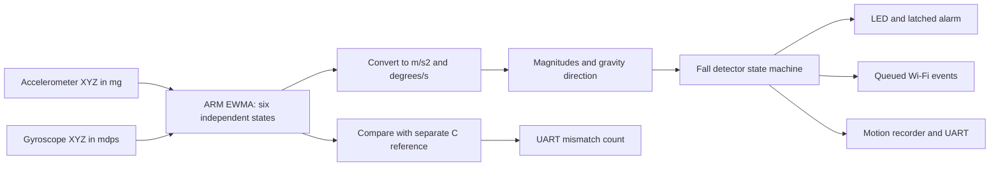
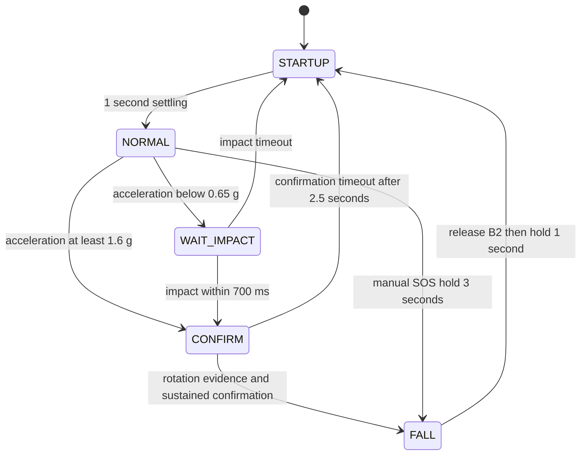

# ElderCare assignment: verification and live demonstration

## Current evidence

The compulsory pipeline is implemented. Automated checks are recorded in
[evidence/AUTOMATED_RESULTS.md](evidence/AUTOMATED_RESULTS.md), with raw logs and
file hashes. Physical detection reliability is **not yet established by this
evidence pack**. No trial counts, detection rates or hardware observations below
are fabricated or pre-filled as passes.

Use `CG2028_Enhancements` for the integrated demonstration;
`CG2028_Assignment` is the simpler baseline and `CG2028_Assignment_Test` is the
supplied hardware assembly harness. All three now contain identical `mov_avg.s`.
The application algorithm and thresholds were not changed for this evidence pack.

The supplied PDF and test harness contain **five open cases, each with 16 samples
on three axes**. The pasted manual also says three cases and a maximum of ten
outputs elsewhere. This pack checks the concrete five-case PDF/harness; it does
not claim access to the three hidden cases.

## Requirements and evidence

Paths below are relative to this project unless otherwise stated. The original
assignment/test projects and PDFs are sibling entries in the Lab3 workspace.

| Requirement | Implementation / software evidence | What to show on hardware |
| --- | --- | --- |
| Exact EWMA interface, pure integer ARM, no persistent state | `Core/Src/mov_avg.s`; no C calls or floating-point instructions; preserves R4-R6 and LR | Run the supplied board test project and save the debugger console |
| Signed values, truncation toward zero, all valid alpha values, nonzero old output | 32,725 emulator inputs per project; independent integer oracle, register and stack checks | Five open cases: all 240 axis outputs match exactly |
| Separate recursive state for all six axes | `Core/Src/main.c`: separate three-element accelerometer and gyro arrays, updated in the axis loop | Rotate/translate the board; show raw/filtered axes and `err=0` throughout |
| HAL, UART1, LED2, accelerometer and gyro startup | `main()` initializes peripherals and checks motion sensor initialization | Boot normally, no initialization error; stationary magnitude approximately 1000 mg |
| Actual assembly outputs used for fall detection | ASM arrays feed unit conversion, magnitudes and `FallDetector_Update`; C arrays only feed mismatch checks | Show source data flow, UART and a recorded physical trial |
| Slow normal LED, fast confirmed-fall LED | Toggle intervals 1000 ms and 150 ms in `main.c` | Record about 2 s and 0.30 s full on/off cycles; measure under load |
| Both motion sensors used | `Core/Inc/fall_detector.h`: acceleration candidate plus rotation evidence and confirmation | Show one actual fall trace with acceleration, gyro and decision; SOS does not prove fall detection |
| Normal/near-fall discrimination | Synthetic tests cover slow posture change, shaking, impact without posture, missing gyro and expired evidence | Repeated walking-like carrying, light shaking, sitting, bending, tilt and controlled lowering |
| Stable fall indication and recovery | Latched `FALL`; release B2 then hold 1000 ms; short tap/held-at-onset/gap cases tested | Move after alarm, tap B2, show alarm persists; release and hold to recover |
| Threshold, alpha and timing justification | Explicit constants, units and rationale below | Labelled repeated trials, actual timings, failures and tuning history |
| Enhancements do not degrade core | Separate sensor/network tasks; capture, UI, receiver and PWM/audio emulator checks | Repeat core trials with uploads, unavailable receiver, buzzer and microphone active |

## Explain the implemented pipeline



The optional raw-motion recorder trigger can use raw axes. The fall decision
itself uses the filtered axes. Manual SOS deliberately creates an alarm through
a separate button path and is labelled `manual_sos`.



Sampling gaps over 100 ms reset non-latched detection to settling. A latched
alarm survives a gap, but button acknowledgement must be rearmed.

## Engineering explanation to support with observations

| Parameter | Current setting | Rationale and limitation |
| --- | --- | --- |
| Sampling target | 20 ms / 50 Hz | Resolves motion sequences over hundreds of milliseconds; actual timing must be measured using `dtMax` and capture timestamps |
| EWMA alpha | 50% for both sensors | Equal weighting of new/previous output; halves remaining step error each sample in the ideal non-quantized model; about five samples to exceed 95% response, roughly 100 ms at target rate |
| Integer rounding | Truncate toward zero | Required exact arithmetic; low-amplitude values can be quantized to zero |
| Low acceleration | Below 0.65 g | Candidate unloading evidence, insufficient alone |
| Impact | At least 1.60 g | Candidate collision/deceleration evidence, insufficient alone; filtered peaks are attenuated |
| Rotation | At least 100 degrees/s | Helps reject purely translational knocks; recent evidence retained for 500 ms, with further evidence accepted early in confirmation |
| Quiet confirmation | 0.85-1.15 g, below 20 degrees/s, 1000 ms | Available only after low-g plus impact and rotation |
| Posture confirmation | At least 60-degree change for 700 ms, 0.75-1.25 g and below 80 degrees/s | Needs a learned pre-event gravity reference; direct-impact path requires this confirmation |
| Confirmation timeout | 2500 ms after impact | Rejects candidates that never establish sustained confirmation |
| Post-event behavior | Latched alarm, explicit acknowledgement | Prevents flicker or apparent recovery just because motion stops |

These are design starting points, not experimentally calibrated claims. Record
why the final settings were retained or changed using both successful and failed
trials. A fixed attachment is necessary for posture to mean anything. The
accelerometer's +/-2 g per-axis range can clip impact peaks; captured axes near
1950 mg are flagged. A missing qualifying sequence can produce a missed fall.

## Repeatable software verification

From `D:\CG2028\Lab3`:

```powershell
python CG2028_Enhancements/scripts/verify_assignment.py --toolchain "D:/stm32ide/STM32CubeIDE_1.19.0/STM32CubeIDE/plugins/com.st.stm32cube.ide.mcu.externaltools.gnu-tools-for-stm32.13.3.rel1.win32_1.0.0.202411081344/tools/bin"
```

The runner checks the actual PDF expected sequences against emulated ARM, verifies
assembly copies agree, runs both core suites, builds the enhancement firmware,
tests that fresh ELF's buzzer/audio logic, runs receiver tests and checks dashboard
JavaScript syntax. It replaces the automated logs/report on each run. Archive the
evidence directory with a submission or physical test session. A build failure
blocks the ELF driver tests so stale binaries cannot be reported as fresh passes.

The current build emits a linker RWX LOAD-segment warning. Software tests do not
exercise electrical peripherals, ISR timing or Wi-Fi hardware.

## Before the live demonstration

1. Import and rehearse building/debugging the projects in CubeIDE. The rubric
   deducts marks if startup takes over five minutes or requires GA intervention.
2. Build/run `CG2028_Assignment_Test`. It uses semihosted debugger output rather
   than the application's UART. Save all five case outputs and the final
   `ALL 5 OPEN TEST CASES PASSED` line. This step remains pending.
3. Build/flash the enhancement project and Resume. Open UART at 115200, 8-N-1.
   Remove motion breakpoints. Keep the board stationary for at least two seconds.
4. Confirm `NORMAL`, `err=0`, acceleration near 1000 mg, low gyro magnitude and
   slow LED. A blank UART is an unresolved setup issue, not a pass.
5. Start the receiver using the same private token as the board. Confirm device
   heartbeat and live sensor data. Keep credentials out of slides and screenshots.
6. Fix the protected board consistently to the fixture. Use a cushioned setup;
   do not perform human falls or drop the exposed board.

## Physical trial plan

Use [evidence/PHYSICAL_TRIALS.md](evidence/PHYSICAL_TRIALS.md) as the record.
The repetition counts below are a proposed rehearsal plan, not rubric-mandated
counts and not a claim of statistically established reliability.

| Trial group | Suggested repetitions | Expected outcome |
| --- | --- | --- |
| Protected fall fixture, three repeatable orientations/motions | Five per variation | Confirmed fall without repeated attempts; retain misses in results |
| Walking-like carrying | Five 20-second trials | No latched fall |
| Light shaking | Five 10-second trials | No latched fall |
| Sitting/controlled lowering | Five per action | No latched fall |
| Slow tilt and medium-speed bending | Five per action | No latched fall |
| Alarm latch and acknowledgement | Three | Further motion/short tap does not clear alarm; release plus one-second hold does |
| Core trials with recording upload and receiver unavailable | At least three positive and three negative trials per condition | Same intended classifications; log sample timing and delivery failures |

For each planned motion, set `debug_capture_request=1` while running in NORMAL,
then perform the motion within four seconds. Recording keeps up to two seconds
before and four seconds after the trigger, at the target sample rate. Wait for
upload completion, label the actual motion and export the CSV. Do not halt the
CPU to trigger or inspect a trial. Only two capture slots fit in RAM.

Record expected class before the motion, not after seeing the decision. Record
every attempt, including missed falls and false alarms. Capture `dtMax`, `err`,
event reason, clipping flags, board mounting, network condition and recording ID.
Use video with UART/LED visible if practical. Measuring impact-to-alarm latency
requires a defined impact timestamp in the trace/video; do not substitute an
assumed timer constant for a measured result.

Report TP/FN for fall trials and FP/TN for non-fall trials, separately by motion
and network condition. Detection fraction = TP/(TP+FN); false-alarm fraction =
FP/(FP+TN) for this defined trial set. Give counts and durations, not percentages
alone. These controlled board results do not establish performance on people.

## Live demonstration sequence

| Step | Action and evidence | Acceptance |
| --- | --- | --- |
| 1 | Show the saved board unit-test console and automated report | Five exact open cases; explain hidden-case coverage without claiming hidden results |
| 2 | Show NORMAL, six raw/filtered axes and mismatch counter | Slow LED, `err=0`, useful UART |
| 3 | Perform carrying, light shaking, bending and controlled lowering | No latched fall; explain candidate rejection if one occurs |
| 4 | Perform the rehearsed protected fall motion | Acceleration and gyro evidence, confirmed `FALL`, fast LED |
| 5 | Move board and briefly tap B2; leave alarm active over 15 s | Alarm stays latched; audible pattern escalates |
| 6 | Release B2 then hold one second | Acknowledgement, settling, NORMAL and slow LED |
| 7 | Hold B2 three seconds in NORMAL | Manual SOS and remote event; clearly distinguish this from fall detection |
| 8 | Mark seen on dashboard | Caregiver acknowledgement recorded; local alarm remains until B2 acknowledgement |
| 9 | Make receiver temporarily unavailable, create a new SOS, restore receiver | Local behavior continues; queued event arrives once, retries are deduplicated |
| 10 | Show motion recording/CSV and microphone response | Trace matches motion; sound reacts and settings revision applies |

Do the full outage rehearsal beforehand. Retry backoff reaches 30 seconds, so
reconnection is not instantaneous. The queue holds 16 events and may drop new
events when full; record `dropped`. Do not describe RAM buffering as persistence
across a board reset. Receiver SQLite history is persistent.

Microphone activity is relative dBFS, not calibrated sound pressure or speech
recognition. Buzzer playback and a 400 ms tail mask activity detection. Current
firmware has no proximity measurement. Music is an optional interaction demo;
prioritize SOS, alarm escalation, caregiver delivery and motion logging for the
elderly-support explanation.

## Presentation evidence to retain

- One pipeline diagram and the state diagram above, consistent with actual code.
- One exact assembly-test result and a live `err=0` interval.
- A fall trace and representative normal/near-fall traces with units and labels.
- Repeated-trial counts, false alarms, misses, latency and sampling observations.
- An outage/recovery example showing local operation continues.
- Limitations: attachment dependence, clipping, finite sampling, RAM queue limits,
  uncalibrated thresholds and private-LAN HTTP.

Each student should be able to explain alpha, signed truncation, six recursive
states, both confirmation paths, acknowledgement and one observed failure case.
The rubric separately assesses each student's presentation/Q&A and the slides.


## OLED integration acceptance (Felix branch)

The OLED is now included in the same firmware as the compulsory pipeline and
other enhancements. See README for wiring. `tests/verify_oled.py` checks the
compiled ARM display driver using mocked I2C transfers, including failed sends
and recovery. It does not prove the physical screen works.

| Demonstration | Evidence to retain | Pass condition |
| --- | --- | --- |
| Boot and normal operation | OLED/LED video plus UART | Smiley, slow LED, `err=0` |
| Actual protected fall trial | Trace showing both sensors and confirmed state; OLED video | Alternating frown/FALL DETECTED, fast LED, buzzer and remote fall event |
| Alarm latch and B2 recovery | Brief tap followed by release and 1 s hold | Tap does not clear; hold clears screen and local alarm |
| Manual SOS | Hold B2 3 s; OLED and dashboard | SOS/frown rather than FALL DETECTED, distinct remote SOS event |
| Caregiver Mark seen | OLED plus dashboard | Dashboard records acknowledgement; local display stays latched |
| OLED absent at boot | Power off, disconnect OLED, reboot, run core trials | OLED failure is counted; motion, LED, buzzer and Wi-Fi still work |
| OLED failure/recovery | Protected bench setup with suitable bus disconnect fixture | No sensor stall; after restored connection, display retries and shows latest state |
| All enhancements active | OLED alternating, buzzer, microphone, recording upload | Record `dtMax`, `err`, classification and response latency |

Repeat at least three alarm/acknowledgement cycles. Measure actual screen-change
latency and sample timing under load; the 100 ms task polling interval is not a
measured worst-case latency. Keep every hardware result pending until observed.
